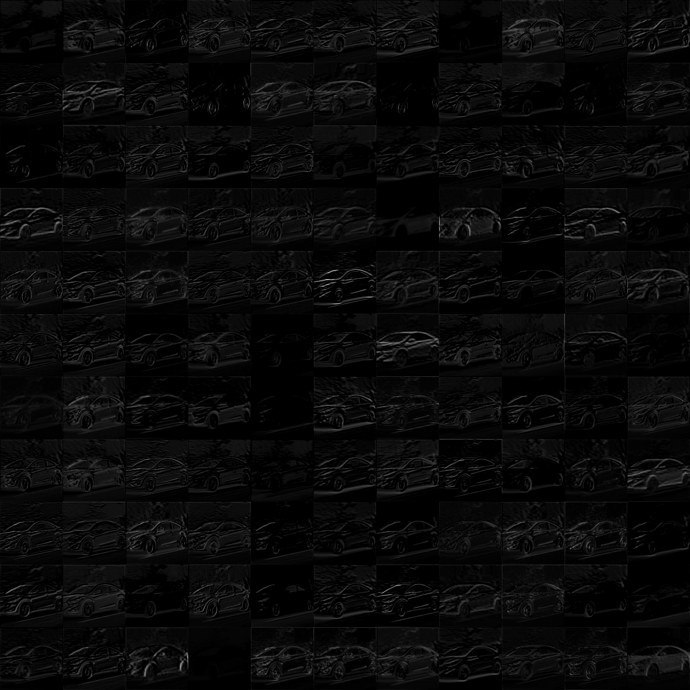
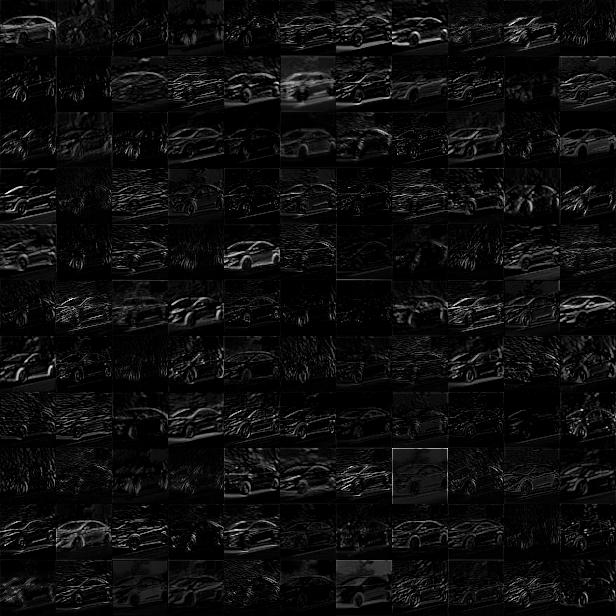
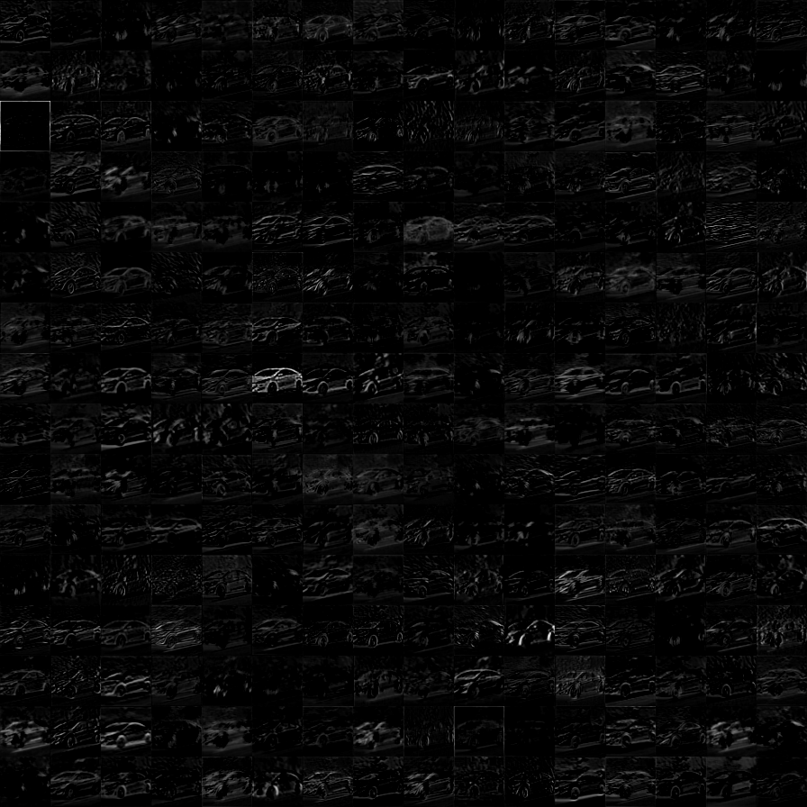
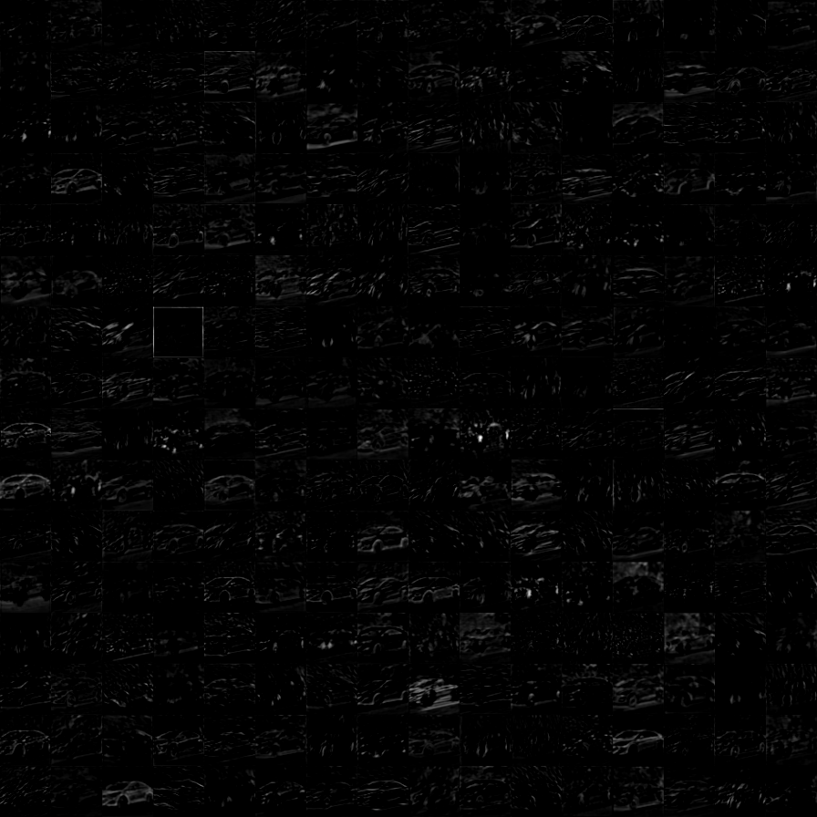
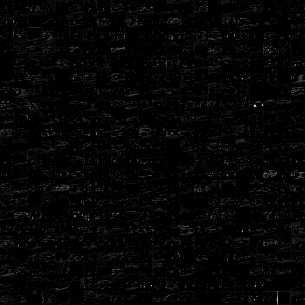
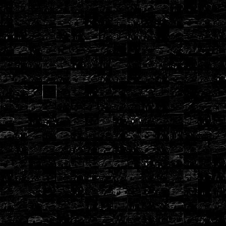
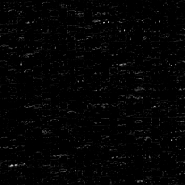
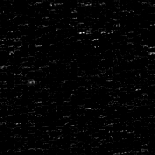
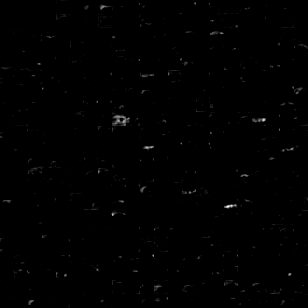
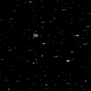

## 特征图可视化

> [https://github.com/alisure-ml/DL-Model](https://github.com/alisure-ml/DL-Model/tree/master/tensorflow-demo/vgg)

> 对于一个好的模型，其特征图中的值是有含义的。因此，可以可视化特征图来查看网络的训练情况。

## VGG

#### 输入

#### conv1_1

#### conv1_2

#### pool1

#### conv2_1

#### conv2_2

#### pool2

#### conv3_1

#### conv3_2

#### conv3_3

#### pool3

#### conv4_1

#### conv4_2

#### conv4_3

#### pool4

#### conv5_1

#### conv5_2

#### conv5_3

#### pool5

