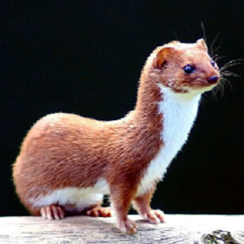
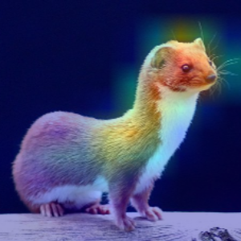

## Grad CAM

博客地址: [可视化](https://alisure.github.io/2018/04/12/DL/%E5%8F%AF%E8%A7%86%E5%8C%96/)


## Paper

* [arxiv: Grad-CAM](https://arxiv.org/pdf/1610.02391.pdf)

* [local: Grad-CAM](./paper/Grad-CAM.pdf)


## 结果

| 虎斑猫| 可视化 |
| :---:  | :----: |
|  |  |


| 黄鼠狼| 可视化 |
| :---:  | :----: |
|  |  |


| 原图：虎斑猫和可卡犬 | 网络预测为可卡犬(run_class=None) |
| :---:  | :----: |
|  |  |


| 指定类别为虎斑猫(run_class=282) | 指定类别为可卡犬(run_class=220) |
| :---:  | :----: |
|  |  |


## 预训练

下载模型[resnet_v2_50_2017_04_14](http://download.tensorflow.org/models/resnet_v2_50_2017_04_14.tar.gz)，解压到`ckpt`下即可。


## 运行

```python
import tensorflow as tf
from GradCAM import GradCAM
from GradCAM_old import GradCAM as GradCAM_old

if __name__ == "__main__":
    result_size = 300
    num_classes = 1001
    model_name = "resnet_v2_50"

    # 1.（可选）标签
    labels = GradCAM_old.load_labels(label_file="./data/imagenet/labels.txt")

    # 2.（必选）输入占位符、数据预处理
    inputs = tf.placeholder(tf.uint8, [None, None, 3])
    inputs_image = GradCAM_old.preprocess_image(inputs, result_size, model_name)
    inputs_image = tf.expand_dims(inputs_image, 0)

    # 3.（必选）网络端点：必须包含三部分：用于可视化的特征图、logits、预测值
    _, end_points = GradCAM_old.get_network_fn(model_name, num_classes)(inputs_image)
    need_end_points = [end_points["PrePool"], end_points["Logits"], end_points["predictions"]]

    # 4.准备好前面三部分后，开始可视化
    grad_cam = GradCAM(inputs, need_end_points, image_file_name="./demo/cat_dog.jpg",  num_classes=num_classes,
                       result_size=result_size, result_file_name="./demo/output.png",
                       labels=labels, checkpoint_path="./ckpt/resnet_v2_50.ckpt")
    # 当run_class为某一个类别时，对分类为该类别的像素进行可视化
    grad_cam.run(run_class=None)
    pass
```

## Reference

* [hiveml/tensorflow-grad-cam](https://github.com/hiveml/tensorflow-grad-cam)

* [Ankush96/grad-cam.tensorflow](https://github.com/Ankush96/grad-cam.tensorflow)

